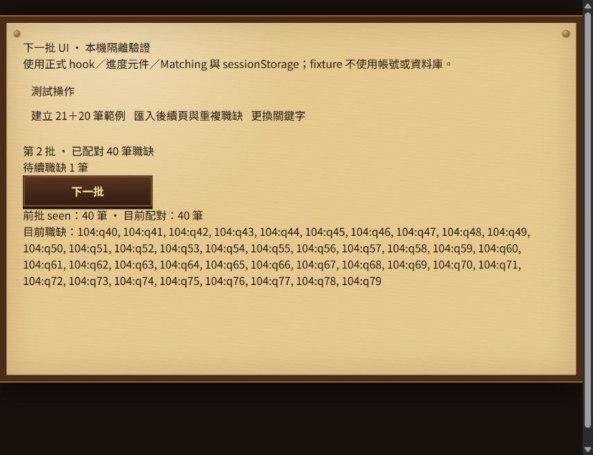
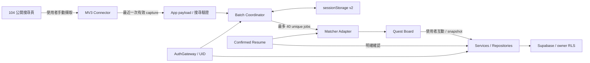

# Job Quest Guild｜求職冒險者公會

將履歷、真實 104 公開職缺與求職紀錄整理成可持續操作的工作流程。Job Quest 是以公會風格呈現的 React／TypeScript 技術作品：使用者確認結構化履歷後，手動擷取 104 職缺，透過連續 40 筆批次進行可解釋的規則配對，再管理收藏、已看、已投遞與略過紀錄。

**[Live Demo → https://jobquest-snowy.vercel.app](https://jobquest-snowy.vercel.app)**

正式介面只提供 104。一般擷取職缺保留在瀏覽器工作清單；雲端保存的是已確認履歷、搜尋偏好，以及使用者互動過的職缺紀錄與 snapshot。

## Screenshots

正式站公開 Auth 入口，2026-10-01 擷取；未登入、未建立測試帳號。


連續批次的隔離 QA 畫面：使用正式 hook／Matching／sessionStorage，搭配合成職缺，展示 Batch 2、seen history 與 pending。**這不是正式站真實 104 擷取驗收，也不是一般使用者的 App 畫面。**



[截圖來源與驗證範圍](docs/screenshots/README.md)

## 使用流程

1. 登入／註冊代稱帳號，或明確選擇「先以訪客試用」。啟動時先還原 session，不自動建立 Guest。
2. 在「冒險者檔案」手動建立或編輯履歷，確認內容後才保存並用於 Matching。草稿不自動保存。
3. 安裝 [104 Connector](browser-extension/jobquest-104-connector/README.md)。在 Job Quest 輸入關鍵字與地區，按「前往 104 搜尋」。
4. 在 104 公開搜尋結果頁，點 Extension 的「擷取目前職缺」，回到 Job Quest 加入目前批次。
5. **逐頁擷取 → 逐頁匯入**。Connector 只保存最近一次 capture；先匯入本頁再擷取下一頁。
6. 收集到 40 個 unique 職缺後，Quest Board 一次呈現本批配對結果。1–39 筆可使用目前職缺進行配對。
7. 超額候選保存到 pending；按「下一批」先消耗 pending，再等待後續頁面。前批 sourceKey 會被略過。
8. 收藏、標記已看／已投遞／略過，或開啟原始 104 職缺連結。F5 可在有效期內還原同一 owner 的批次。

訪客資料綁定目前身份；登出或清除瀏覽器資料後可能無法找回。Guest 可建立代稱帳號升級，沿用同一 UID。登入既有帳號是身份切換，會先顯示警告，不自動合併 Guest 資料。

## Tech Stack

| 層 | 技術 |
| --- | --- |
| Frontend | React、TypeScript、Vite、Tailwind CSS／scoped CSS |
| Auth / cloud data | Supabase Auth、PostgreSQL、Row Level Security |
| 職缺輸入 | Chrome／Edge Manifest V3 Extension、`activeTab`、`scripting`、`chrome.storage.session` |
| Browser working state | 版本化 `sessionStorage`、owner UID、fingerprint、30 分鐘 TTL |
| Matching | TypeScript 規則引擎、技能正規化、需求分析、分數與排序 |
| Tests | Vitest、合成 fixtures、App／domain／adapter／repository regression tests |
| Hosting | Vercel 靜態部署，build output 為 `dist/` |

## System Architecture



UI 透過 hooks／services 呼叫 coordinator 與 repository。Batch domain 維持候選流及狀態轉換，storage／matcher adapters 將瀏覽器儲存與既有配對核心隔開。

[完整架構與資料生命週期](docs/architecture.md)

## Auth Architecture

- `AuthGateway` 還原 session 並確認 server user，再提供單一 Auth context 給產品。
- 帳號 trim 後轉小寫，長度 3–32，以英文字母開頭，只接受英數及底線。
- `authIdentity` 將帳號轉成內部 synthetic identifier，供 Supabase Email/password SDK 使用；UI 顯示代稱，沒有自行建立密碼資料表。
- Guest → 帳號透過一般 SDK 的 identity update／password update；驗證 UID 不變，成功後沿用既有 owner 資料。
- upgrade 分階段處理，未完成不顯示成功；pending marker 不保存密碼或 token，使用者需重新輸入密碼續接。
- 相同 UID 保留產品 subtree；不同 UID remount，避免前一個身份的草稿與狀態帶入新帳號。
- 目前沒有密碼找回、SMTP recovery、產品 OAuth 登入或帳號自動合併。

[Auth foundation](docs/jobquest-auth-foundation-implementation.md) · [Same-UID isolated verification](docs/jobquest-anonymous-upgrade-same-uid-verification.md)

## 104 Connector

Connector 擷取目前頁面**已載入且通過既有驗證的全部有效職缺**，依 DOM 順序處理；沒有固定 10／17／20 筆頁面上限。canonical identity 為 `104:{jobId}`，原始連結為 `https://www.104.com.tw/job/{jobId}`。

background worker 與 App 都驗證 payload。malformed／重複 sourceKey payload 整包拒絕，不覆蓋上一份有效 capture。capture 只在 Extension session 暫存最新一頁，期限 30 分鐘。

App bridge 僅允許 `http://localhost:5173` 和 `https://jobquest-snowy.vercel.app`；同視窗、同 origin、有限指令與 request ID 檢查保持。Extension 不使用任意 host wildcard，也不自動翻頁、捲動或背景爬取。

[安装與權限](browser-extension/jobquest-104-connector/README.md) · [Production origin verification](docs/jobquest-connector-production-origin.md)

## Continuous 40-job Batch

104 的頁面不是 Batch 邊界。例如頁面 18＋20＋20 筆，Batch 1 取前 40，剩下 18 筆依順序保存為 pending；下一批先從這 18 筆繼續。

- current batch 最多 40 個 unique jobs。
- 去重依據只有 sourceKey；current、pending 與 seen history 都參與排重。
- 下一批將前批已呈現 sourceKey 加入 seen，先消耗 pending，不足才等待手動匯入。
- 換 keyword／region 的新搜尋 fingerprint 會 reset current／pending／seen／批號。
- `jobQuest.real104Batch.v2` 保存 UID、fingerprint、current／presented phase、pending continuation metadata、seen、批號與最早 capturedAt。
- TTL 以最早 capturedAt 為準；追加 capture 或 F5 不延長 30 分鐘。
- F5 還原 presented 時以目前 Confirmed Resume 重算分數；不把舊分數當永久資料。
- v1 Batch 與 legacy REAL session 有既有相容策略；owner 不符、過期、corrupt 或儲存失敗不假裝成功。

[Continuous V2](docs/jobquest-real104-continuous-batch-v2.md) · [Next-batch UI](docs/jobquest-real104-next-batch-ui.md)

## Matching Engine

Matching 只讀使用者已確認的 ResumeProfile 與目前提交的職缺，採可解釋的規則，不呼叫 LLM。

| 分項 | 最大權重 |
| --- | ---: |
| 主要技能覆蓋 | 55 |
| 職涯方向 | 15 |
| 年資 | 15 |
| 專案技能佐證 | 10 |
| 補充情境技能 | 5 |

技能覆蓋不足或需求資訊信心較低時，會限制總分，避免缺少證據卻高分。結果包含命中／缺少技能、理由、breakdown 與 S／A／B／C／D 等級。排序為分數降冪，再依 publishedAt 降冪及 job ID；時間欄位可能來自既有 normalization，不代表精確的 104 發布時間。

這是求職參考工具，分數不是錄取機率或對人才的客觀判定。

[Matching source](src/matching/scoreCalculator.ts) · [Matching regression tests](tests/matchingEngine.test.ts)

## Supabase / RLS / Persistence

| 資料 | 保存範圍 |
| --- | --- |
| `resume_profiles` | 使用者明確確認的結構化履歷；編輯草稿不自動入庫 |
| `job_preferences` | 明確搜尋操作的關鍵字、地區、排序等偏好 |
| `user_job_actions` | 收藏／已看／已投遞／略過 flags，及互動職缺的 nullable `job_snapshot` |
| 一般 capture、current／pending／seen | 瀏覽器 working state，不批量寫入 Supabase |

資料表 owner 為 `user_id`；migration 定義 authenticated CRUD policies，`auth.uid() = user_id`，update 同時有 USING／WITH CHECK。匿名 Auth session 仍有 UID，與尚未登入的 `anon` role 不同。

snapshot 讓收藏／紀錄在 working batch 不存在時仍可解出原職缺，避免只剩無法顯示的 ghost ID。它不是整個 104 職缺資料庫；缺少合法 snapshot 不會捏造職缺。

[SQL migrations](supabase/migrations) · [Snapshot foundation](docs/jobquest-job-snapshot-foundation.md) · [Ghost-job fix](docs/jobquest-job-snapshot-ghost-fix.md)

## Security Design

- Frontend 僅讀 `VITE_SUPABASE_URL`／`VITE_SUPABASE_PUBLISHABLE_KEY`。publishable key 是公開 client 設定，資料授權仍由 Auth／RLS 負責。
- `.env*`、Vercel metadata、工作輸出與常見憑證檔都排除；只提交 key 空白的 `.env.example`。
- service-role／secret／AI API keys 不進前端、Extension、README 或 repository。
- 密碼交由 Supabase Auth 處理；產品 pending marker 不保存密碼／token。SDK 自身的 session persistence 與產品 working state 是不同邊界。
- Connector 僅有限 origin／message commands，capture 寫入僅允許 Extension popup，拒絕任意網站與 malformed payload。
- source URL、canonical identity、UID、fingerprint 與 TTL 都需驗證；storage failure 顯示錯誤並保留可重試狀態。

[Read-only release checks](scripts/verify-release.mjs) 掃描可辨識的憑證、JWT、禁止檔案及入口文件連結；這是 release guard，不是對所有未知 secret 格式的保證。

## Local Development

建議 Node.js 24，使用 lockfile 安裝：

```sh
npm ci
cp .env.example .env.local
```

在 `.env.local` 填入這個 JobQuest 專案的 **publishable key**：

```dotenv
VITE_SUPABASE_URL=https://neqwkiruqfevlchiajor.supabase.co
VITE_SUPABASE_PUBLISHABLE_KEY=<your-publishable-key>
```

前端 client 目前固定核對這個 project ref，不能只改 env 就任意切換 Supabase 專案。若沒有該專案的可用 Auth／資料設定，`npm ci` 和 build 並不代表登入／雲端功能可用。自建 backend 需要另行處理 project guard、migrations 與 Auth 配置，本 release 未提供一鍵任意專案部署。

```sh
npm run dev          # http://localhost:5173
npm run typecheck
npm run build        # dist/
npm run preview      # 本機建置預覽，非 production server
```

Windows PowerShell 可用 `Copy-Item .env.example .env.local`。安裝 Extension 後，重新整理 JobQuest 分頁，讓 bridge 注入。

## Test / Manual Acceptance

```sh
npx vitest run
npm run test:matching
npm run test:104
npx vitest run tests/connectorProductionOrigin.test.ts
node scripts/verify-release.mjs
node scripts/verify-release.mjs --staged
```

最近一次完整自動檢查（2026-10-01，production-origin 工作項目）：**2384 PASS／5 FAIL**。5 個都是既有 RP-014 PDF reconstruction baseline，名稱及完整錯誤訊息與前次一致；非 PDF 測試通過，沒有把失敗 skip 或標成 expected failure。Typecheck／build／Manifest 檢查通過。[測試結果](docs/jobquest-connector-production-origin.md)

**PRODUCTION MANUAL ACCEPTANCE = PASS**。2026-10-01 使用者回報正式站正常使用，Production Connector 已在正式網址人工驗收 PASS，REAL104、Matching、Batch／Next Batch 正式流程正常；`CONNECTOR_PRODUCTION_ORIGIN = PASS`。驗收來源為 **USER_MANUAL_BROWSER_TEST**，不是 Codex 自動測試推定。

既有 confirmed resume、F5、partial commit、sourceKey 去重、Matching／收藏／原始連結亦有使用者回報的基線 PASS。自動測試、隔離 QA 截圖與上述正式站人工驗收是不同證據。此回報不包含 AI／PDF production runtime、1111，亦不列出 Supabase Dashboard 的實際 Site URL／Redirect URL 值。

[Resume persistence acceptance](docs/jobquest-confirmed-resume-persistence.md) · [已回報 Batch 基線](docs/jobquest-real104-full-page-continuous-batch-design.md)

## Deployment

已首次部署到 [Vercel production](https://jobquest-snowy.vercel.app)，公開首頁可載入。

- Frontend build：`npm run build`；output：`dist/`。
- Hosting env：僅以上兩個 Supabase public env，在 build time 注入。
- 不上傳 `.env.local`、server secrets 或整個專案目錄當靜態站。
- production Connector origin 已加入；使用者須重新載入 Extension。
- Supabase Site URL／Redirect URLs 是遠端 Auth 設定，不隨 Vercel env 或 Extension 修改而自動更新。
- 使用者已確認正式站、Production Connector 與 REAL104／Matching／Batch／Next Batch 的 production manual acceptance PASS。
- 本次 GitHub 技術 release 沒有重新部署網站，也未切換成 GitHub 自動部署。

[首次部署紀錄](docs/jobquest-initial-production-deploy.md) · [部署設定盤點](docs/jobquest-production-deployment-audit.md)

## Known Limitations

- 真實來源只有 104；1111 的既有型別／fixtures 不代表實際 Connector 已完成。
- 正式履歷入口是手動編輯／確認。AI／PDF extraction foundation 與研究測試保留，但 **AI／PDF production runtime = Pending**；未整合成已上線產品功能。
- 全套有 5 個已知 PDF reconstruction failures，因此不能宣稱全套全綠。
- 桌面 Chrome／Edge 需安裝 unpacked Extension；尚未發佈到 extension store，沒有行動瀏覽器支援承諾。
- 只能擷取已載入公開 DOM；104 改版可能影響 selectors。沒有自動翻頁、捲動、private API 或保護繞過。
- 每頁需先匯入；下一次 capture 會覆蓋尚未匯入的 Extension payload。
- working state 為同一瀏覽器／tab 的有效期工作清單，不是跨裝置同步；local 與正式 origin 不共用 browser storage。
- 新竹、嘉義採來源可驗證的縣市分類，不宣稱沒有證據的純縣精度。
- 代稱帳號沒有可收信 inbox，未提供密碼找回或自動資料合併。
- 歷史 investigations／CONTEXT 為分階段紀錄，可能描述已被後續票件取代的行為；目前入口以本 README、source 與較新的對應工作項目為準。

## Roadmap

下列是後續候選工作，**不是已完成功能**：

- 維護已 PASS 的正式流程，持續補充改版後的回歸與人工驗收紀錄。
- Extension 打包／發佈、版本管理與 DOM 改版維護流程。
- 處理既有 PDF baseline；若另行授權，才評估可用的 AI extraction 與個資／成本邊界。
- 評估帳號 recovery、無障礙與更多裝置的體驗。
- **1111 = Roadmap**：必須另做 public-source evidence、Connector 與驗收，不從 fixtures 推定支援。

## 專案導覽

```text
src/components, pages       公會 UI、Auth、履歷與 Board
src/hooks                   owner / persistence / batch orchestration
src/integrations/job104     search URL、schema、normalization、bridge client
src/matching                規則配對核心
src/services, repositories  domain / adapters / Supabase data seams
browser-extension/          正式 104 MV3 Connector
supabase/migrations         user-owned schema / RLS / snapshot
supabase/functions          尚未整合產品的 AI foundation
tests/                      回歸、契約及合成 fixtures
experiments/                保留的開發實驗，不是正式入口
docs/                       架構、階段證據與驗收記錄
```

[GitHub technical release record](docs/jobquest-github-technical-release.md)
