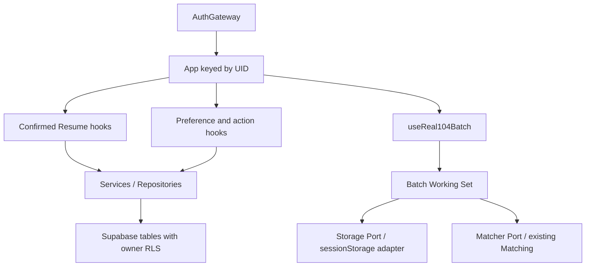
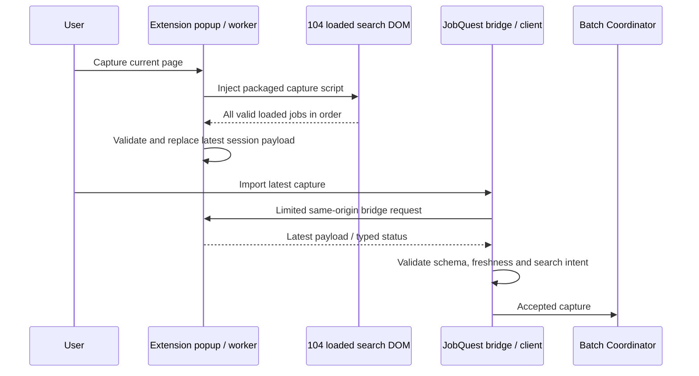
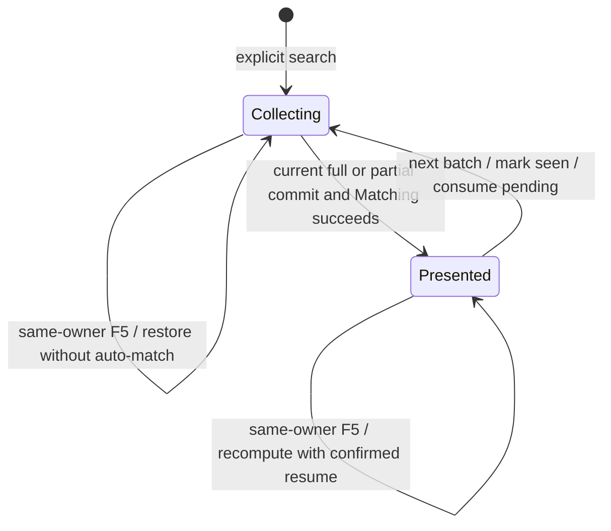

# Job Quest Architecture

2026-10-01。此文件描述目前程式碼，不把 historical investigation／PoC 當成 production 功能。

## Runtime composition

`main.tsx → StrictMode → AuthGateway → App`。Gateway 負責 session restoration、登入／註冊／明確 Guest entry，以及 owner identity。App 組合 confirmed resume、偏好、職缺操作與 REAL104 working set；UI 不直接拼裝 SQL。

## Auth and owner isolation

`authService` 讀取 session 與 server user；`authIntegration` 將 raw Auth user 投影成 UI 可用的 Guest／代稱狀態，序列化帳號操作並處理過期結果。啟動沒有 session 時顯示 Landing，不偷偷建立匿名帳號。

`usernameAuthService` 使用普通 Supabase SDK。normalization 與 synthetic identifier 在 `authIdentity`，帳密不走自行建置的資料表。Guest upgrade 的身份與密碼更新分階段驗證；只在確認原 UID、identifier、confirmation 等條件後顯示完成。

同 UID upgrade 保留 App subtree。身份切換以 UID key remount；pending marker 只保存版本／UID／canonical username，不保存密碼或 token。舊 REAL working cache 使用 owner sidecar；新 Batch envelope 自身驗證 owner UID。SDK 的 Auth session 儲存與 Batch sessionStorage 不混為一個資料模型。

## Capture boundary

`capture-jobs.js` 不要求固定頁面數量。worker 與 App validation 仍保留 canonical identity、source URL、時間及 duplicate checks。每次 capture 只保存最新一頁，必須「capture → import」之後才擷取下一頁。

允許的 App origins 僅 localhost:5173 與 `https://jobquest-snowy.vercel.app`。Manifest、bridge 入口與 worker sender allowlist 對齊。`STORE_CAPTURE` 僅接受本 Extension popup；App 只能 STATUS／GET_LATEST／CLEAR。

## Continuous batch state

`real104BatchWorkingSet` 定義 current 上限 40、pending 原順序、seen 去重、fingerprint、批號及轉換。storage port 不知道 UI；matcher adapter 不修改配對核心。Matching 失敗不能把未完成批次當成已呈現。

`jobQuest.real104Batch.v2` 保存 canonical Jobs、pending 的 `sourceUrl`／`capturedAt`／`validOrdinal`、seen、owner、keyword／region／fingerprint、phase、batchNumber、firstCapturedAt／presentedAt。pending 提供上一頁中斷後的候選續接，不授權任何自動導覽或抓取。

最早 capturedAt 的 30 分鐘 TTL 不因新 capture／save／F5 延長。換搜尋 fingerprint 全部 reset；UID 不符、corrupt／version mismatch／expired 都安全拒絕。v1 Batch 與 legacy REAL session 沿既有相容路徑處理，不以舊 snapshot 掩蓋新 batch 的拒絕狀態。

`useReal104Batch` 使用目前 UID、Confirmed Resume 與 operation epoch。延遲結果不能覆寫新 owner／搜尋；presented restore 以目前確認履歷重算，不保存舊配對分數為永久權威。

## Matching

`matchingService → prepareResumeForMatching → analyzeJobRequirements → calculateJobMatch → sortMatchedJobs`。

分項權重為 skills 55、career 15、experience 15、projects 10、context 5；coverage／confidence ceilings 控制資訊不足的高分。分數、等級、理由與 skills breakdown 全由規則產生，不由 AI 推論。

Matcher adapter 只把本次 committed current batch 傳入 service；pending／seen 不進 Matching input。Board 顯示的是排序後的配對結果，並非把候選流順序當分數排序。

## Persistence lifecycle

| 資料 | Owner / 生命週期 |
| --- | --- |
| Resume draft | 本機暫時編輯，不自動保存；明確確認才進 existing repository |
| Confirmed Resume | `resume_profiles.user_id`；Auth-ready restore，供 Matching 使用 |
| Search preferences | `job_preferences.user_id`；明確搜尋操作保存，restore 不觸發 capture |
| User job actions | `(user_id, job_key)`；flags＋nullable canonical snapshot |
| Batch current / pending / seen | sessionStorage v2，UID＋fingerprint＋最早時間 TTL |
| Extension capture | Chrome session storage，最新一頁，30 分鐘，不含履歷 |

migrations 定義 owner RLS CRUD policies，update 同時核對舊／新 row ownership。client-side checks 改善隔離與錯誤處理，不能取代 RLS。source 內含 `'1111'` 欄位相容性，不代表 production Connector 支援 1111。

snapshot 僅沿使用者互動保存，不把普通 capture 全部存到雲端。收藏／紀錄可用 snapshot 解出不在 working set 的職缺；無合法內容時不合成 ghost Job。

## Deferred modules and acceptance boundaries

`supabase/functions/parse-resume-ai`、PDF parsing／layout research、Mock fixtures 與實驗 Extension 都保留供開發。正式 App 是手動履歷確認＋104 Connector；沒有 AI PDF 產品入口、1111 live Connector 或自動爬取。

**PRODUCTION MANUAL ACCEPTANCE = PASS**：2026-10-01 使用者回報正式站正常、Production Connector 在正式網址人工驗收 PASS，以及 REAL104／Matching／Batch／Next Batch 正式流程正常。`CONNECTOR_PRODUCTION_ORIGIN = PASS`；來源為 **USER_MANUAL_BROWSER_TEST**，不是本圖或自動測試推定。

**AI／PDF production runtime = Pending；1111 = Roadmap**。上述人工 PASS 不涵蓋這兩項，也沒有提供 Supabase Dashboard Site URL／Redirect URL 的實值；release 不推定或修改該遠端設定。

[目前功能與限制](../README.md) · [Continuous V2](jobquest-real104-continuous-batch-v2.md) · [Origin safety tests](../tests/connectorProductionOrigin.test.ts) · [SQL migrations](../supabase/migrations)
