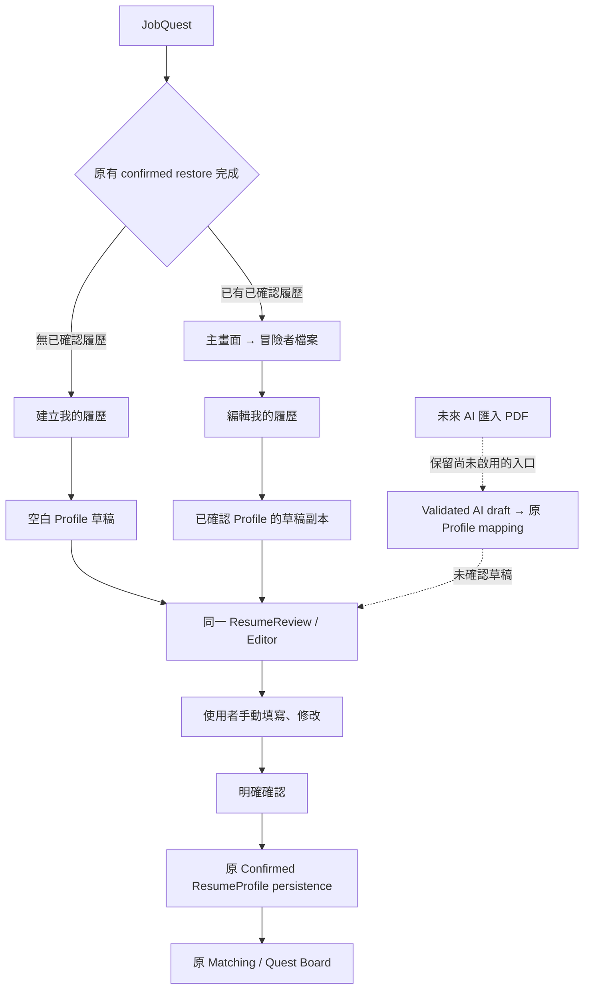

# JOBQUEST MOCK PDF ENTRY REMOVAL DESIGN

2026-09-29。Type: **INVESTIGATION → DESIGN ONLY**。
Design status: **COMPLETE — AWAITING IMPLEMENTATION APPROVAL**。
Recommended next action: **APPROVE_REMOVE_MOCK_PDF_ENTRY_IMPLEMENTATION**。

最小可行方案：新使用者按「建立我的履歷」，以沒有任何人物／技能事實的空白
ResumeProfile 草稿進入既有 ResumeReview；既有使用者按「編輯我的履歷」，繼續
用既有 confirmed profile 的草稿副本。確認後仍呼叫原 persistence.confirm。
移除正式路徑上的 Mock PDF 選檔要求與替換 PDF 按鈕，保留 Mock adapters、測試
及未來 AI architecture。沒有需要新 editor、Auth、資料表或 schema 的證據。

**窄依賴已確認：ResumeReview 的來源文案硬編碼為 MOCK／PDF。** 未來實作需明確
授權 presentation-only 的文案介面；否則只改上游入口，仍會把手填草稿稱作 Mock
分析結果。欄位編輯、missing-data handling、驗證、確認、snapshot、保存、Matching
都不需要改變。這不是未解的 domain contradiction，但不能省略這個授權範圍。

本次只新增本設計文件。沒有 production/test/config/database 改動或 deletion，
沒有實作空白 factory、移除 UI、呼叫 AI／Edge runtime、改 Auth 或做 browser acceptance。
本次使用者 context 將所有既有可用下游流程列為已人工驗收／frozen；本設計依該
邊界處理，不補做驗收、不捏造逐項 manual PASS，也不改寫歷史驗收文件。

## 1. Observe — Current Entry Flow

### CURRENT_ENTRY_FLOW

目前沒有 client router library；[main.tsx](../src/main.tsx:6) 掛載 App，App 用
`page` state 選擇 Board/Profile/Collection/Settings。初始 resume 是 null。

```text
main.tsx → App
  → existing Anonymous Auth + confirmed-profile restore
  → restore 尚未完成：入口 hidden / loading，Matching 不解鎖
  → 無 confirmed resume：ResumeStep
      → 選擇 PDF（僅檔名/MIME/size；不讀取內容）
      → 產生 Mock Extraction（complete 或 incomplete fixture）
      → ResumeReview(profile=synthetic ResumeProfile)
      → 使用者修改、確認
      → confirmResumeDraft → App.persistence.confirm
      → confirmed local snapshot + existing Supabase save
      → existing Matching / Quest Board
  → restored confirmed resume：直接進主畫面，不需重新選 PDF
      → 冒險者檔案 → 編輯履歷 → ResumeReview(existing profile)
      → 或「重新選擇 PDF」→ 同一 ResumeStep Mock 流程
```

### Exact Entry / Dependency Map

| Output | Observed evidence |
| --- | --- |
| PDF_UPLOAD_COMPONENT | [ResumeStep.tsx:45](../src/components/onboarding/ResumeStep.tsx:45)：file input；同檔案 47–59 的選檔／Mock scenario／generate button，沒有獨立 UploadZone |
| MOCK_EXTRACTION_CALL_SITE | [ResumeStep.tsx:22](../src/components/onboarding/ResumeStep.tsx:22)：選 complete/incomplete adapter 後 await extract(file)；唯一可達正式 UI 呼叫點 |
| RESUME_REVIEW_ENTRY | [ResumeStep.tsx:38](../src/components/onboarding/ResumeStep.tsx:38) 將結果當既有 profile 傳入；[ProfilePage.tsx:10](../src/pages/ProfilePage.tsx:10) 可直接傳 confirmed profile，不需 extraction |
| CONFIRMED_PROFILE_RESTORE_ENTRY | [App.tsx:25](../src/App.tsx:25) 共用 Auth；[useConfirmedResumePersistence.ts:17](../src/hooks/useConfirmedResumePersistence.ts:17) 等待 Auth 後 start；[confirmedResumePersistence.ts:64](../src/services/confirmedResumePersistence.ts:64) read → commitLocal；App resume 分支切回主畫面 |
| Confirm/save handoff | [App.tsx:68](../src/App.tsx:68) 的 onComplete 與 [App.tsx:105](../src/App.tsx:105) 的 onUpdate 都交給既有 persistence.confirm；不把 raw draft 直接送 Matching |
| Official manual-edit entry | ProfilePage「編輯履歷」→ cloned draft；取消不呼叫 onUpdate，確認後才更新 |
| MANUAL_EMPTY_DRAFT_SUPPORT | **NO — 沒有專用 factory 或正式 create entry；YES — existing editor/type 能接收空白 shape，詳下節** |

[mockResumeExtraction.ts:5](../src/services/mockResumeExtraction.ts:5) 只驗證副檔名、
MIME 與 size（非空且 ≤10 MB），沒有 PDF container admission。它不讀 arrayBuffer/
text/stream/slice，也不傳送 File；即使選擇內容不是 PDF 的 synthetic bytes，也
會回傳 Demo Adventurer、Demo University、固定技能／經歷／專案／證照。
不能把「檔案已選擇」描述為「履歷內容已分析」。

`mockIncompleteResumeExtraction` 先呼叫完整 adapter，再清空部分 education/
certifications、簡化 work/project，仍保留 Demo name、skills 和 entries；**不等於
空白人工草稿**。`src/data/mockResume.ts` 也有 sample person，不能拿來 seed manual entry。

### Official MOCK/PDF UI Locations

| Location | Current copy/control | Future official treatment |
| --- | --- | --- |
| App:53 | MOCK 草稿／AI 未分析 PDF／原始 PDF 不上傳的 notice | 改為來源中立、draft 未確認／確認後保存的說明；沿用 error/loading/status/retry |
| App:59 | restore error 建議「重新上傳」 | 改為「手動建立並確認履歷」，不改 restore/retry 行為 |
| App:65–69 + ResumeStep:43–59 | 登錄、選擇 PDF、Mock scenario、產生 Mock Extraction、onboarding MOCK ribbon | 正式入口改為「建立我的履歷」；不要求 File，不 mount Mock upload |
| ResumeReview:29,46,48 | 預設返回重新選檔、MOCK kicker、AI/DEMO 預填／Mock PDF 說明 | 受限 context copy；手填／編輯使用真實文案，Mock caller 維持原文案 |
| ResumeReview:9,52–80 | 「未辨識，可手動補充」missing hints/placeholders | manual/edit context 可用「未填寫，可手動補充」；值/控制項/驗證不變 |
| ProfilePage:14–16 | 「履歷分析結果」、編輯履歷、重新選擇 PDF | 「已確認履歷資料」、編輯我的履歷；移除正式 PDF replacement path |
| App:106,117 | Settings「MOCK 履歷」與 footer「MOCK RESUME」 | resume 文案中立化；不改 reset handler 或 job-source mode |

App 的職缺來源 radio、Board/Search 的 MOCK/DEMO job-fixture 標籤不是 Mock PDF
入口；它們必須保留。不能做全域 MOCK/DEMO 搜尋取代，否則會隱藏 frozen REAL/
Demo 職缺隔離。GuildSidebar 仍可沿用「冒險者檔案」導航，不需要改 Board layout。

`Onboarding.tsx` 仍保有 SourceStep → ResumeStep 的舊組合，但不在目前 main→App
可達路徑；`SettingsPage.tsx`、`useCloudProfile.ts` 同樣不是這個 App 使用的路徑。
`resumeService.analyzeResume` 的 legacy deterministic PDF/DOCX parsing 也不是
目前 ResumeStep 的 upstream。這些不列為本次可刪除對象，不重新啟用、不做清理。

## 2. Reproduce — Evidence, Not Browser Acceptance

使用 synthetic files／profiles、實際元件 callbacks 和既有 tests 重現，沒有
瀏覽器操作、私人履歷或 live cloud requests。暫時 observation probe 已移出 project，
存於 `%TEMP%\jobquest-entry-design-20260929-3d1e83c9`，沒有保留新的 project test。

| Observation | Result |
| --- | --- |
| ResumeStep 初始生成按鈕 disabled，選檔後才能操作 | REPRODUCED |
| 生成後的實際 handoff 為 ResumeReview + synthetic profile；未自動 confirm | REPRODUCED |
| 四種 File readers、fetch 未呼叫；內容不同也產生同樣 facts | VERIFIED — synthetic probes + existing tests |
| existing Review 可接空白 Profile shape，提供新增／移除 work 等原控制項 | VERIFIED |
| 空白 name 禁止確認；手動填 name、保留空 optional areas 即可確認 | VERIFIED — unchanged rules |
| 手工構造的 profile 仍顯示「目前使用 Mock 示範資料」及重新選檔 | REPRODUCED — 窄介面依賴 |
| ProfilePage edit path 直接進 Review，cancel 不更新；replacement 進 ResumeStep | REPRODUCED |
| restore loading gate、restored confirmed matching、save failure 與 retry | Existing focused tests PASS |
| AI candidate 未確認不能送 matching，mapping 保持 existing domain shape | Selected pure contract tests PASS |

Executed checks：

```powershell
npx.cmd vitest run tests/jobquestEntryDesignProbe.test.tsx tests/manualAcceptanceFlow.test.tsx tests/resumeReviewHardening.test.tsx tests/confirmedResumeApp.test.tsx tests/confirmedResumePersistence.test.ts tests/confirmedResumeRepository.test.ts
npx.cmd vitest run tests/aiResumeExtractionContract.test.ts -t 'keeps a valid unknown extraction|cannot match a completed extraction|maps a full bilingual extraction|matches only the explicitly confirmed snapshot'
```

第一組 **72/72 PASS**＝5 temporary probes + 67 existing tests；第二組 **4/4 PASS**，
144 unselected tests skipped。合計 **76 executed checks PASS**。
這些證明現在的 wiring／generic editor compatibility，不代表未實作的 manual entry
已完成或 future acceptance A–H PASS。沒有執行 parse-resume-ai handler/runtime。
TypeScript/build **NOT RUN**：本次是設計，production 不變，不借用上一項的結果。

## 3. Root Cause and Removal Classification

Root cause 是 **entry orchestration + hardcoded source copy**：App 無履歷分支與
ProfilePage 的 PDF replacement 都選擇 ResumeStep；ResumeStep 用 File 存在與否
作為進入 Mock draft 的門檻。ResumeReview 接一般 Profile，不要求 File／extraction
status；confirmed persistence 亦不要求 extraction provenance。現有功能不缺第二個
editor，只缺誠實的 manual initializer 和 official entry wiring。

| Code/control | Classification | Decision |
| --- | --- | --- |
| App 官方無履歷的 ResumeStep mount、Mock resume notices | A. REMOVE_FROM_OFFICIAL_UI | 用 manual entry／中立文案取代，原 status/retry/restore gate 保留 |
| ProfilePage「重新選擇 PDF」及 replacing 分支 | A. REMOVE_FROM_OFFICIAL_UI | 移除正式可達入口；保留 edit + 原 onUpdate callback |
| Review 的 hardcoded Mock/PDF/back/missing copy | A. REMOVE_FROM_OFFICIAL_UI（僅 official context） | 來源／用途文案介面，不刪 Review、不改編輯／確認邏輯 |
| ResumeStep、mockResumeExtraction、mockIncompleteResumeExtraction、selection validator | B. KEEP_FOR_TESTS_OR_DEV | tests 有直接使用證據；不刪 adapter/component、不新增公開 dev route |
| manualAcceptanceFlow／resumeReviewHardening 的 fixture/adapter assertions | B. KEEP_FOR_TESTS_OR_DEV | 留下測試依賴；將少數 official App-entry expectations 改測新入口 |
| mockResume fixture、off-route Onboarding/SettingsPage/useCloudProfile | B. KEEP_FOR_TESTS_OR_DEV | 非目前正式 entry；保留，不聲稱已有 story/dev route，也不清 dead code |
| AI shared schema/DomainFields/ReviewCandidate/mapDomain/ExtractionResult | C. KEEP_FOR_FUTURE_AI | 全部保留，不調 schema 或把 evidence 變 confirmed truth |
| parse-resume-ai handler/auth/privacy/index/config 與 focused contract/handler tests | C. KEEP_FOR_FUTURE_AI | 僅保存既有架構，不呼叫／部署／修 provider |
| documented callAiResumeExtraction(file) → Review handoff | C. KEEP_FOR_FUTURE_AI | 明確保留 planned seam；前端目前沒有此 callable implementation |
| resumeService／legacy parsers／architectural ADRs | C. KEEP_FOR_FUTURE_AI / historical architecture | 不重新啟用、不刪除，不作為 manual entry 的 prerequisite |
| Review fields/add-delete/validation/confirmation snapshot | D. FROZEN_DO_NOT_TOUCH | 只允許上列 presentation interface，功能本體原封保留 |
| Profile type、confirmed persistence/repository、Auth、preferences | D. FROZEN_DO_NOT_TOUCH | 同 shape、同 save/restore triggers、同 owner/session 行為 |
| REAL 104/normalization/Matching/Board/actions/session/job_snapshot | D. FROZEN_DO_NOT_TOUCH | 不改 code、algorithm、canonical identity、TTL、resolution/count |
| MOCK/DEMO job-source UI 與 fixture isolation | D. FROZEN_DO_NOT_TOUCH | 移除 Mock PDF 不等於移除 Demo jobs |

Mock adapter 是 **YES — useful and preserved**；正式入口未來不再使用它，仍有
automated tests 及保留的 Mock component 作為直接 consumers，不能稱為 completely unused。

## 4. Smallest Official V1 Design



### New User

等現有 Auth/profile restore gate 完成且確認無 saved profile，顯示「建立我的履歷」。
按下才產生本次獨立 draft 並開 existing Review；不選檔、不呼叫 Mock／parser／AI、
不自動 save、不把 draft 寫入 local.resume。既有七個區域可填：基本資料、技能、
學歷、工作經歷、專案、證照、求職方向。

返回按鈕沿用 onChangeFile callback 介面，但顯示「返回」，回到 create CTA 並丟棄
未確認草稿。不刪雲端。Draft 不因 parent re-render 重新初始化；重新開始才建立新
物件。Restore/owner transition 沿用原 gate；manual entry component lifecycle 應
跟著有效入口重置，不把前一身份的未確認內容接到另一身份。不得改 Auth service。

確認仍跑 `confirmResumeDraft` → 原 App callback → `persistence.confirm`；clone、
name trim、updatedAt、optimistic confirmed state、雲端 save/retry 全部沿用。
沒有保存成功前的自動完成宣告，沿用現在的 saving/saved/error notice。

### Existing User

還原後保持現在的主畫面/Board，不強迫再填履歷、不改 default job mode。使用者
到「冒險者檔案」按「編輯我的履歷」，使用原 profile 開 Review。Review 的
structuredClone 隔離草稿；取消只關閉 editor，不 save、不改 confirmed Profile。
確認仍用原 onUpdate/persistence.confirm，既有 Matching 接收新的 confirmed snapshot。

刪除正式的「重新選擇 PDF」入口，但保留 ResumeStep source。Profile overview 說明
改成「這是你已確認的履歷資料」，不用「分析結果」推定資料來源。Settings reset
仍只按現在的 handler 清本次資料，沒有 account/auth/cloud-delete 改動。

### Empty Manual Draft Contract — Proposed, Not Implemented

唯一 initialization path 概念：`createEmptyResumeDraft(): ResumeProfile`，不接 File。
不從 mockResume、完整／incomplete Mock adapter 或 AI candidate 拷貝再清部分欄位。
使用 existing type，沒有第二個 Draft domain model 或新 persisted provenance field。

| Existing field | Initialization |
| --- | --- |
| id | 本次 UI draft 的新 UUID；technical identity，非人物資料 |
| name | `''` |
| skills | `[]` |
| education | `{ school: '', department: '', graduationStatus: '' }` |
| workExperiences | `[]`；不預填一筆空白／虛構職稱 |
| projects | `[]`；不預填 sample project |
| certifications | `[]` |
| careerDirections | `[]` |
| updatedAt | draft creation instant；確認時仍由原 confirm utility 更新 |
| level | `1`，沿用目前 repository 的 technical/game display baseline；非能力推論 |
| abilities | `[]`，不填 Demo 70/60、不推論能力分數 |
| parseMetadata | omitted；沒有檔名、解析器、偽造 provenance |

完全空白的 Profile **可編輯但不可直接確認**，因 name 空白。原 rules：名稱要非空；
每筆保留的工作須有 title、每筆保留的專案須有 name；optional areas 可保持空白。
不增加必填技能／學歷／證照，不拿假 name 來解鎖按鈕，也不放寬原 rules。
使用者修改 skills 不需要新增 analyzer 來更新 gamified abilities；本項不改這個
顯示邏輯或 Matching。Technical fields 不等於履歷 facts。

### Required Narrow Review Interface

Proposed optional UI-only context：`manual-create`／`confirmed-edit`／`mock`，可以
在未來 AI 專項增加對應 draft 文案。預設 Mock 保留 existing dev/test callers 的
原行為；正式兩條路徑明確傳 context，不靠 name、parseMetadata 或猜測 provenance。
Context 不寫入 ResumeProfile／database、不影響 Match、不改 onConfirm signature。

| Context | Proposed visible copy |
| --- | --- |
| manual-create | `DRAFT · 手動建立履歷`；「請填寫你的履歷資料。草稿尚未確認，確認後才會保存並用於職缺匹配。」 |
| confirmed-edit | `DRAFT · 編輯已確認履歷`；「正在編輯已確認履歷的草稿副本。取消不影響原內容，確認後才會更新。」 |
| mock/dev | existing MOCK/DEMO explanation，仍清楚表示沒有分析 PDF |

manual/edit missing hint 可改為「未填寫，可手動補充」，Mock 保留「未辨識」。
只替換 kicker、description、missing copy 和已有的 back-label prop；不改 DOM layout、
fields、add/delete、canConfirmResumeDraft、confirmResumeDraft、saving guard、failure
retaining draft、clone、required conditions 或 confirmation snapshot。

**Frozen dependency conflict: YES — presentation-only hardcoded copy。**
**Frozen functional behavior change required: NO。**
Implementation approval 必須明列這個窄介面；若只能原封保留 Review 文案，就應
STOP，第一 blocker 是 ResumeReview:46/48，不能讓 manual UI 被稱作 Mock PDF。
目前設計已有明確解法，因此 recommendation 為 approve scoped implementation，
不是宣稱允許修改任意 frozen behavior。

## 5. AI Seam Must Survive

現在已有 [aiResumeExtractionV1.ts](../supabase/functions/_shared/aiResumeExtractionV1.ts)：
wire JSON schema、ReviewCandidate（REVIEW_REQUIRED）、DomainFields、mapDomain、
response validation 與 evidence UNVERIFIED。`parse-resume-ai` 是獨立 server runtime
architecture。這些不依賴 mockResumeExtraction，不會因撤下 Mock entry 而需要刪除。

`callAiResumeExtraction(file)` 目前只在設計／freeze docs 中作為預留前端名稱；
在 src 沒有 callable definition/import，沒有 active UI Edge invocation。不能寫成
「已保留可運作的 AI 匯入按鈕」。Future attachability 是 existing type、contracts、
mapping、Review handoff、architecture/test preservation，runtime readiness 仍 pending。

未來仍是 PDF → AI validated unaccepted candidate → existing ResumeProfile-compatible
draft（app-owned technical metadata）→ 同一 Review → user confirmation → 原 save/
Matching。保持既有外傳授權／attempt binding 架構，不以 Mock fallback 代替失敗 AI。
現有 contract 的 factual fields 與 technical metadata 分離；不為此次 manual entry
修改 AI JSON schema、certifications wire scope、provider/model 或 parser。

`acceptReviewedCandidate`／`matchingFields` 的 admission oracle 目前在 test helper，
不能當作已接到 production UI 的函式。四個 selected pure tests只證明契約、clone
與確認限制，不代表 AI runtime 已可用。本次不新增或啟用 AI/PDF official control。

## 6. Future File Change Allowlist

只有另行批准實作後才修改下列檔案／新增 helper：

| File/component | Intended future change |
| --- | --- |
| src/App.tsx | 以 manual entry 取代無履歷的 ResumeStep；中立 resume notices/error/ribbon；保持原 restore/save/confirmed Matching handoff 與 job flows |
| src/pages/ProfilePage.tsx | 「編輯我的履歷」；移除 official replacing-PDF branch/import；更新 overview source-neutral copy；onUpdate/cancel 不變 |
| src/components/onboarding/ResumeReview.tsx | 僅上列 optional presentation context/missing-copy plumbing；核心 editor/confirm 不變 |
| Proposed src/services/manualResumeDraft.ts | 唯一 createEmptyResumeDraft，existing Profile shape、zero fake facts；本次尚未建立 |
| Proposed src/components/onboarding/ManualResumeEntry.tsx | 輕量 CTA/draft lifecycle wrapper，render 原 Review；不是第二個 editor、不是新 router |
| tests/manualAcceptanceFlow.test.tsx | 只更新官方 App-entry 舊 Mock/PDF assertions；保留 mock adapters、confirmation/matching tests |
| tests/confirmedResumeApp.test.tsx | entry stub/copy expectations 改為 manual entry；原 restore/save/failure/owner assertions 保留 |
| Proposed focused manual draft/entry tests | empty factory、no File/network、create/edit/cancel、existing confirm/persistence、A–H regression seams；本次未實作 |
| Current design/context docs | implementation 後記錄實際 diff/checks/manual checklist，不捏造 PASS |

明確保留原內容：src/types/index.ts、src/utils/resumeReview.ts、mockResumeExtraction.ts、
ResumeStep.tsx、mockResume fixture、Auth/client、confirmed resume hook/controller/
repository、preferences、REAL 104 Connector/normalizer/link helper、Matching modules、
Board/cards/styles、job action hook/controller/repository、REAL session/TTL、snapshot
adapter/resolution、schema/migrations/RLS/grants、AI shared/Edge architecture 與 focused
AI contract tests、legacy parser/analysis files、歷史 ADR／freeze records。

不要為相容手填新增 migration／來源欄位／另存 Draft；不要把 confirmed profile
的 id 重新生成；不要因刪 UI 入口而刪所有 contains-MOCK、PDF 或 AI 的檔案。

## 7. Future Design Acceptance A–H — NOT VERIFIED

| Case | Future implementation assertion |
| --- | --- |
| A New user | restore ready/no profile → 建立我的履歷 → same Review；無 File、Mock、parser 或 AI prerequisite |
| B Empty manual resume | 所有 factual fields 為空／[]；無 sample person/skills/education/work/project/certification/ability score |
| C Confirm/save | user fills valid name/retained-entry requirements → original confirm snapshot + existing save/retry；no draft autosave |
| D Existing edit | restored profile → 編輯我的履歷 → unchanged independent editor；cancel no update；confirm same callback |
| E Confirmed-only Matching | new/edit draft 不修改 confirmed local.resume；Matcher 只吃確認／還原的 Profile；late unconfirmed mutation 不影響 snapshot |
| F REAL 104 | extraction/normalization/canonical sourceKey/links/Board/actions/TTL/job_snapshot source hashes & relevant tests preserved |
| G Truthful official UI | no Mock PDF選檔/generate/replacement entry；manual/edit 文案不稱資料為 Mock/PDF/AI分析結果；job Demo 標籤仍準確 |
| H Future AI | schema/map/ReviewCandidate/architecture/contract tests 保留；handoff 仍是同一 Review；不宣稱 runtime READY |

未來實作後才跑 scoped tests、TypeScript/build，提供使用者手動 A–H；Codex 不替代
使用者 browser final acceptance。此處 A–H 都是 acceptance contract，**不是 PASS**。

## 8. Deliverable / Preservation

| Report field | Result |
| --- | --- |
| Current entry flow | selected PDF → metadata-only Mock fixture → Review → explicit confirm → existing save/Matching；saved profile bypasses entry |
| Official MOCK/PDF UI locations | App no-profile/notices/settings/ribbon、ResumeStep、Review source copy、ProfilePage replacement，詳 Section 1 |
| mockResumeExtraction usage | one official ResumeStep call site + incomplete adapter + direct focused tests；does not read PDF |
| Manual empty-draft support | NO dedicated initializer/entry；YES existing editor compatibility |
| Frozen dependency conflict | YES — hardcoded Review presentation；NO required change to frozen functional behavior |
| Official V1 flow proposed | 建立我的履歷／編輯我的履歷 → existing Review → confirm → original persistence/Matching |
| Future files to change / explicitly preserved | Exact allowlist and preservation list in Section 6 |
| AI seam preserved | YES — existing architecture/contracts/mapping; client callable remains planned, not implemented |
| Mock adapter preserved for dev/tests | YES |
| Database change required | NO |
| Auth change required | NO |
| Resume Review redesign required | NO |
| Production / existing tests changed or removed | NO |
| UI removed / manual factory implemented | NO / NO |
| AI/OpenRouter/Edge runtime invoked | NO |
| Browser acceptance performed | NO |
| TypeScript / build in this design item | NOT RUN |
| Recommended next action | APPROVE_REMOVE_MOCK_PDF_ENTRY_IMPLEMENTATION，含限定 Review presentation interface |

Before/after SHA-256：baseline **879** files 全部 unchanged；只有本文件新增，after
**880**。沒有 source/test/config/schema/auth/AI changes；暫時 probe 已從 project 移除，
其 source 和 investigation evidence 留在上列 temp directory。CONTEXT 與既有 freeze
records 保留。這個範圍檢查不等於新的 runtime／manual acceptance。

STOP。等待後續明確 implementation approval；不在本 Work Item 移除 UI 或實作 factory。
